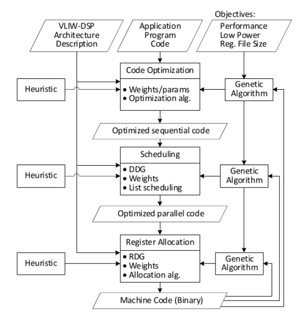
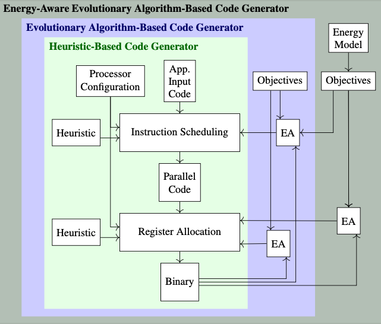

# VLIW Retargetable Compiler Backend

This repository implements a Very Long Instruction Word (VLIW) retargetable compiler backend. 
The processor and instruction description can be modified with XML description files to adapt different VLIW processors. 

The backend contains code optimization, instruction scheduling and register allocation.
Each step contains a heuristic implementation as well as a genetic algorithm implementation.
The genetic algorithms increase the code compaction and thus increase performance
but can consume many computing resources while doing so.
Below is a figure with an overview of the compiler backend.




The VLIW retargetable compiler backend is described in the following paper. If you use this project, please cite it as follows:

> Florian Giesemann, Lukas Gerlach, and Guillermo Payá-Vayá. “Evolutionary Algorithms for
> Instruction Scheduling, Operation Merging, and Register Allocation in VLIW Compilers”. In:
> Journal of Signal Processing Systems 92.7 (2020), pp. 655–678. issn: 1939-8115. doi: 10.1007/s11265-019-01493-2

#### New Features for Energy-aware Register Allocation (January 2024)

The compiler is extended to minimize the energy consumption.
It requires an energy model that is based on the energy that a change of read accesses to the register-file consumes.
Due to the large solution space, an evolutionary algorithm is implemented to find a register allocation that minimizes the energy consumption.
Different instruction schedules can open up the register allocation freedom, therefore, the evolutionary algorithm-based instruction scheduling is modified, so that it can be combined with the evolutionary energy-aware register allocation.
Below is a figure with an overview of the compiler backend.



The energy model estimates the energy consumption that is need to switch the register accesses between two instructions.
Below is an example energy consumption that the register-file consumes, when it switches from the registers V0R0 to the registers of the second line.
```
SL V0R2, V0R0,  V0R0  ; ADD V0R4, V0R0,  V0R0
SL V0R2, V0R58, V0R34 ; ADD V0R4, V0R61, V0R5
// Dynmic Read Access energy consumption= 17.364 pJ  
```

The energy model is based on the observation, that the dynamic energy consumption of reading from the register-file is larger than writing to it.
Additionally, in a standard logic cell implementation of the register-file, the read port logic of the register file is structured as a multiplexer tree.
This structure can be utilized to formulate an interaction linear regression energy consumption model.


The energy-aware register allocation is described in the following paper. If you use energy-aware aspect of this project, please cite it as follows:

> Stuckmann, F.; Weißbrich, M.; Payá-Vayá, G. "Energy-Aware Register Allocation for VLIW Processors." Journal of Signal Processing Systems. 2024. https://doi.org/10.1007/s11265-024-01930-x.

## Table of Contents

[Getting started](#Getting-started)

- [Installation](#Installation)
- [Configuration](#Configuration)
- [Compilation](#Compilation)
- [Formatting](#Formatting)
- [Documentation](#Documentation)


[Contributors](#Contributors)

[License](#License)

[Citation](#Citation)

## Getting started

### Installation
Clone the repository
```bash
git clone https://github.com/tubs-eis/VLIW-Retargetable-Compiler-Backend.git
```


### Configuration
In `conf` an exemplary, reduced target architecture is described.

The processor configuration, such as issue slots and register file configuration is described in `processor-config.xml`.

The assembly is described in `base.xml`. 
Instructions can be grouped into functional units and the instruction encoding is provided.

An example program is provided in `assembly.asm`. 
In the assembly virtual register (VxRn for virtual register n) will be allocated in the register allocation process to a physical register (V0R0, i.e. register 0 of register-file partition 0).
Physical register are used to transfer information across basic block borders.

The `mlweights.txt` file describes an alternative scheduling for instruction scheduling.
Each Micro Operation (MO) is assigned a weight and the MO with the highest weights are scheduled first.


### Compilation

To compile the project and run a basic example using list scheduling heuristic and evolutionary scheduling, please run `compile_basic_example.sh`.

To compile the project and run an energy-aware scheduling, please run `compile_energy_aware_register_allocation_example.sh` (todo).


### Formatting
To format the source code according to LLVM-Formatting, please run `format.sh` .

### Documentation
The documentation can be generated with `generateDocumentation.sh` .


## Contributors

- Guillermo Payá Vayá (Technische Universität Braunschweig)
- Fabian Stuckmann (Technische Universität Braunschweig)
- Florian Giesemann 
- Lukas Gerlach

## License

This open-source project is distributed under the MIT license.

Copyright (c) 2022 Chair for Chip Design for Embedded Computing,
Technische Universitaet Braunschweig, Germany
www.tu-braunschweig.de/en/eis

Use of this source code is governed by an MIT-style
license that can be found in the LICENSE file or at
https://opensource.org/licenses/MIT

## Citation
The VLIW retargetable Compiler backend tool is described in the following paper. If you use this project , please cite it as follows:

> Florian Giesemann, Lukas Gerlach, and Guillermo Payá-Vayá. “Evolutionary Algorithms for
> Instruction Scheduling, Operation Merging, and Register Allocation in VLIW Compilers”. In:
> Journal of Signal Processing Systems 92.7 (2020), pp. 655–678. issn: 1939-8115. doi: 10.1007/s11265-019-01493-2
